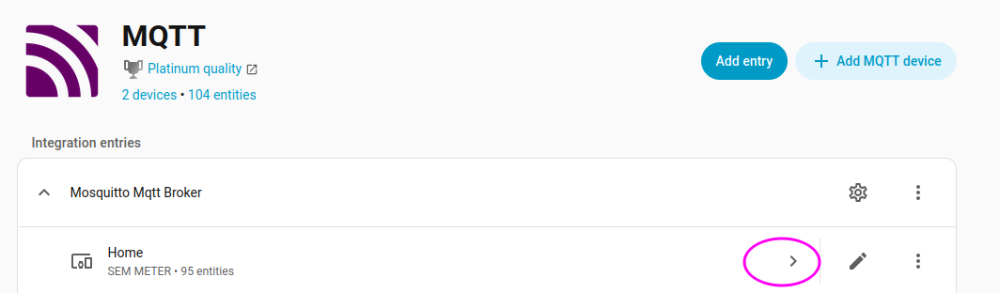

# How to setup Fusion Power Smart Home Energy Monitor in Home Assistant

## Introduction

The Fusion Power Smart Home Energy Monitor a reasonably-priced energy monitor for your home.  You can install it yourself in your breaker panel.  Here's what it looks like:


You can install it into your breaker panel by yourself or by professional.  After installation, it looks like this:


After installation, you can then see the energy usage of your entire home in the free app on your phone.


A nice thing about this device is that it also publishes all that energy usage by [MQTT](https://mqtt.org/), which is a a standard Internet-of-Thing protocol.  Home Assistant
can receive that information and display it in Home Assistant.  This guide is to help you set that up.

## Steps

### Overview

1. Install the meter.
2. Configure the MQTT server on your Home Assistant (if it isn't already).
3. Configure the meter to send energy usage information to your Home Assistant.
4. Configure your MQTT to read that received energy information and display it.
5. Optionally, add that information to the Energy dashboard in Home Assistant.

Along the way, we'll confirm that steps worked correctly.

### Install the meter.

Install the meter as described in the manual.  If you're scared of working on the breaker panel then perhaps get a professional to do it.  If you've ever swapped a light switch
by yourself then you are qualified to do this work yourself, too.  It's not too difficult.

After you install the meter, you'll install the app according to the instructions.  When you're all done, you should be able to see your energy usage in the app.  Don't go
on to the next step until this step is done.  Also, you should connect your app to your wifi and make sure to get the latest version of the software into the device.  This is
because the latest version sends MQTT messages more frequently that the old version (every 2 seconds instead of every 30).  That will make the information more useful for you.

If you are paranoid about letting the device and app have access to your Wifi, you'll be able to isolate the device from accessing the internet later on.  The device can work with
Home Assistant on your local wifi without ever accessing the internet again.  You just need the internet this one time to get the latest firmware.  You could make a temporary wifi
network for the device, let the device use it, and then delete that network or change the password on it.  You won't need the internet again.

To get the latest firmware, go into the configuration of the device and do a firmware update.


### Configure the MQTT server on your Home Assistant (if it isn't already).

Now you need to install the MQTT server (called a "broker").  The server is what the meter will send messages to.  The same device that is running Home Assistant can also be your MQTT server.  If you
already have the MQTT broker, you don't need to do this.  Click this, find the MQTT broker, and install it:

[](https://my.home-assistant.io/redirect/supervisor_store/)

Now you'll open up that add-on and start it:

[](https://my.home-assistant.io/redirect/supervisor_addon/?addon=core_mosquitto)

I suggest that you enable "Start on boot" and also "Watchdog" so that the broker will always be running.


Your energy meter can send messages to your Home Assistant device with your Home Assistant username and password but I prefer to have a separate username and password.  That way,
when I put the username and password into my device, it won't have access to the entirety of Home Assistant, just the MQTT server, for sending messages.

If you don't already have a username and password, click on "Configuration", then put in a username and password in the "Logins" box like this:


```
- username: mqtt
  password: abcd1234
```

You can use any username and password.  The spaces and format of that text are important so make sure that you get it right.  You'll need the username and password for the next step.

### Configure the meter to send energy usage information to your Home Assistant.

Now that you have the broker running, it's time to configure your device to send messages to Home Assistant.  In the app, in the configuration, select "Home assistant":


You'll first turn on "Add user permission" so that the device has permission to send MQTT messages to your server.  You could send to the SEM cloud but you already have your own
server on the home assistant device so you're going to use that.  Also, this way you don't need to be on the internet

First, let's find the URL for your Home Assistant.  For me, it's http://homeassistant.local:8123/  If I click on that link while connected to my wifi, it opens up Home Assistant.
You need to use whatever URL is correct for your wifi network access to Home Assistant.  This should be an address that works from inside your wifi network even when you are not
connected to the internet through a cellular network.  You can test this by putting your phone in airplane mode, turning on only the wifi (so no 5G), and see that it still works.

Put that address into the IP, for exapmle, `mqtt://homeassistant.local`.  For port, use `1883`, which is the default MQTT broker port.  If you changed that port number in the broker
configuration, use whichever port is the "Normal MQTT" port.

For username and password, use the ones that you put in the MQTT Configuration.  For example, `mqtt` and `abcd1234`.  Now click on "Confirm".  Your app should report success.
Don't go on to the next step until this is successful.

### Configure your MQTT to read that received energy information and display it.

By now, your device should be connecting to your Home Assistant's MQTT broker and sending information about energy usage.  Go to your Home Assistant integrations:

[](https://my.home-assistant.io/redirect/integrations/)

If you don't yet have an MQTT integration, add one:

[](https://my.home-assistant.io/redirect/config_flow_start/?domain=mqtt)

If you already have one, just open it:

[](https://my.home-assistant.io/redirect/integration/?domain=mqtt)

This integration is was talks to the broker that we previously setup.  It will get the information from the broker and display it.  First, let's make sure that the information is
actually arriving from the device.  Click on the configuation gear icon and subscribe to the topic `SEMMETER/#`.  Then click on "Start listening".  You should see a report from
the meter arrive every 2 seconds.


In my report, I see the number `1236` a lot!  That's actually the voltage recorded, `123.6V`.  Yours might be different.  All that matters is that you are getting messages.  Don't
move on to the next step until this works.  Also, I blurred out the MAC Address of my device.  However, you'll need it!  It should be 12 digits and capital letters.  Mine starts
with `94A9` but yours might be different.  You can also find this number as the Serial Number of your device listed in the app.

### Configure your MQTT to read that received energy information and display it.

Now that we've confirmed that Home Assistant is getting all the energy information, we want Home Assistant to display it.  You *could* click on the "Add MQTT device" link in the
MQTT integration but you'd have to do about 95 of them and it would be tedious.  Instead, I've prepare a blueprint that will do it for you.  Click on this:

[](https://my.home-assistant.io/redirect/blueprint_import/?blueprint_url=https%3A%2F%2Fgithub.com%2Feyal0%2Fsem-meter-home-assistant%2Fblob%2Fmain%2Fcreate_fusion_energy_smart_home_energy_monitor_devices.yaml)

This will add the "Create Fusion Energy Smart Home Energy Monitor Devices" blueprint to your blueprint dashboard in Home Assistant.  The blueprint is a sort of "wizard" that will
guide you through the steps of adding all the MQTT devices.  In the blueprints dashboard, click on it.


This will open up the blueprint.  Now you need to fill out all the information in there.  The Serial Number will be the Serial Number (aka MAC address) that we got from before.
You can name your device whatever you want and you can change that later, too, but a convenient name might be the location that is supplied by the breaker panel.  For example, you
might choose the name "Home".  For "Phases", you should enable the phases that you connected into your device with the bigger clamps.  Look in the app and see which ones of
"A", "B", and "C" you have and enable those.

For each Circuit, you need to provide a name and multiplier.  From your app, copy the names and multipliers into these circuits.


Do this for all 16 circuits.  If some of them are unused, you can just leave them alone.  You'll be able to change them later if you want.

When you're done, click on "Save script" and just save it with the default name.
(The button to save is called "Rename" but just click that one.)  If you have additional meters, open up the blueprint again and save another script with a different name.

Now go to that script that you just made.  Click this link and you should find it:

[](https://my.home-assistant.io/redirect/scripts/)

If you click on the script, that will let you reconfigure the blueprint.  You can also reconfigure it as much as you want.  For now, just click on the 3 dots and run the script.


That will add all the entries into the MQTT integration.  Now open that integration and take a look:

[](https://my.home-assistant.io/redirect/integration/?domain=mqtt)



The script created a bunch of sensors.  You should see, for each phase and circuit, information like voltage, power, energy in, etc.  


The information on that screen should match the info in your app and be updating about every 2 seconds.  You can click on any of them and change how they display,
like to change the icon or the number of digits after the decimal point.  If you want to change any of them names, you can also go back to the script, click on it to modify it,
and then run it again.

### Optionally, add that information to the Energy dashboard in Home Assistant.

If you want, you can also add all these new measurements to your energy dashboard.  The energy dashboard shows and hour-by-hour analysis of the energy that you use.  You can
add all the new measurements that the meter is collecting.  First click this link:

[](https://my.home-assistant.io/redirect/config_energy/)

In the section titled "Individual devices" you'll first add the new "Total Energy In".  That is the total energy that is going into the breaker panel.  Then you'll add the "Energy In"
of each circuit that you are measuring.  When you add the circuit, set the "Upstream device" of the circuit to be the "Total Energy In" that you previously added.  This makes it so
that the energy counted by the circuit is not double-counted as part of the energy measured in the "Total Energy In".


The data on the energy dashboard is hourly so it will take some time until the data is part of the dashboard.  Also, the daily totals are calculated from midnight to midnight so
a complete day's record won't be available until midnight has passed twice.